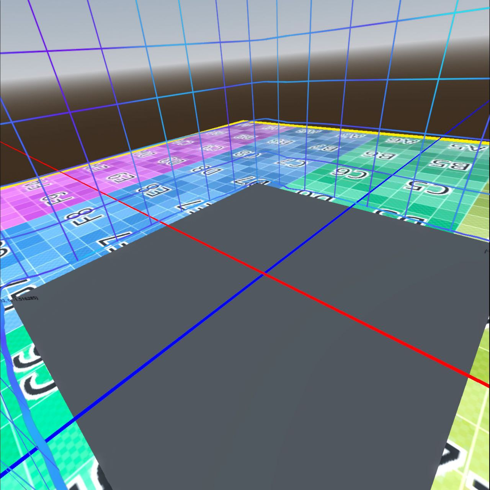

# Roomscale XR Template

This is a basic template project for a Roomscale game, just for natural movement.

It has a very basic fallback for standing/sitting and also for desktop mode.

Made this for the ​Godot XR Game Jam July 2024​ while learning the basics of roomscale for my next project.

## Keymap

Press A-button to show/hide the settings panel

Press Trigger to select / change values in the panel

In standing/sitting mode, standard thumbstick movement.

Press Esc in desktop mode to show up the UI panel, and cursors or WASD to move.

## Features

### Template User Settings

It integrates XRToolsUserSettings with other TemplateUserSettings in a single UI panel.

You can switch from Roomscale to Standing and the player node and reference frame is updated.

### Template globals

Ready to store a simple state variable for your game and some other useful globals.

Now it stores some useful data from the XR initialization, like:

* xr_enabled
* system_info
* passthrough availability
* game mode (roomscale / standing / flat)
* play area size

### OpenXRFbRenderModel

This project demoes the controller FbRenderModel in Quest 2 / Quest 3 and has a fallback (just a cube) for other runtimes.

### DebugKonsole

If you do use print when thinkering and designing, this template also includes a simple debug tool that draws floating labels in the scene, so you can print fixed messages to a floating panel by typing:

	DebugKonsole.print("your message here")

or floating messages that dissapear by typing:

	DebugKonsole.print("your message here", false)

You can just comment all DebugKonsole lines before release :)

## Play Area

In roomscale mode the play area is calculated and a rectangle is drawn with the boundary limits

In standing mode it depends on the xr runtime, seems like steamVR doesn't provide a play area but Meta is providing a simple 2x2 square

## Godot version and addons

This code works with Godot 4.3.beta2 and uses the following addons

Godot XR Tools

Godot XR Toggle  (just use the toggle to test the desktop version)

## Known issues

play_area_changed signal in XRInterface is not working
